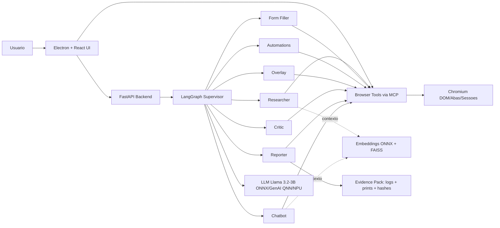

# Agentic Browser — Itaú + Qualcomm (Projeto completo)

Navegador agentic para analistas do Itaú em PCs Copilot+ com Snapdragon (X Plus/X Elite). A IA é nativa no browser: o agente enxerga o DOM, raciocina sobre o contexto das páginas e age (abrir abas, clicar, preencher, extrair e evidenciar). A arquitetura combina backend Python com LangGraph (orquestração multi‑agentes) e frontend em React + Electron, que expõe ações do navegador como tools via MCP (openTab, find, click, fill, extract, screenshot) — sem Playwright.

A IA roda on‑device: Llama 3.2‑3B em ONNX/QNN acelerado pela NPU, e embeddings (nomic‑embed‑text) para RAG local. Isso traz baixa latência, privacidade (dados não saem da máquina) e viabilidade corporativa. Segurança e compliance incluem allow/deny lists por domínio/ação, guard anti‑prompt‑injection, HITL em passos sensíveis e Evidence Pack (ZIP com logs, prints, hashes) para auditoria.

## 👥 Equipe

- Daniel Jesus
- Gabriel Nichols
- Rafael Caldeiras
- Vinicius Laranjeira

## 🔎 Visão geral

Seu projeto é um navegador agentic pensado para analistas do Itaú usando PCs Copilot+ com Snapdragon. Diferente de “um chat com IA”, a inteligência está nativa no browser: o agente percebe o DOM, raciocina sobre o contexto e executa ações. A arquitetura combina backend em Python (LangGraph para multi‑agentes) e frontend em React + Electron (expondo actions como tools via MCP) para perceber → raciocinar → agir com evidências e privacidade local. O LLM roda on‑device (ONNX/GenAI + QNN/NPU) e o RAG é local (embeddings ONNX + FAISS).

## 🏗️ Arquitetura (alto nível)

## 🤖 Agentes (resumo)

- Supervisor: entende a intenção e roteia o fluxo
- Researcher: pesquisa multi‑abas, extrai, sintetiza e cita fontes
- Form Filler: preenche formulários “one‑shot” com validações
- Automations: executa rotinas gravadas/generalizadas
- Overlay: co‑browse assistido (dicas, destaques, ações)
- Critic: guard de segurança/compliance (allow/deny, injection)
- Reporter: evidencia e empacotamento (ZIP com logs/prints)
- Chatbot: conversação com RAG e histórico

## ✅ Principais capacidades

- Execução 100% local por padrão (dados não saem da máquina)
- RAG com índices por projeto/fonte
- Policies de segurança (domínios, ações) e HITL para passos críticos
- Evidence Pack com logs estruturados e integridade (hashes)

## 🧩 Requisitos

- Windows ARM64 (Snapdragon X Plus/X Elite) ou Linux x64
- Python 3.12+ e Node.js 18+

## 🚀 Como usar (resumo)

- Preparar ambiente: variáveis (.env) e modelos locais
- Iniciar backend FastAPI na porta 8080
- Iniciar frontend Electron/Vite
- Interagir via UI (pesquisa, formulários, automações, chat)

Para detalhes técnicos e contratos de ferramentas, consulte `readme_agentic_browser_qualcomm_itau.md`.

## 📝 Conventional Commits (curto)

- Formato: `tipo(escopo opcional): descrição`
- Tipos: feat, fix, docs, style, refactor, perf, test, chore

Ex.: `feat(researcher): síntese com citações`

## 📄 Licença

Apache‑2.0. Veja `LICENSE` na raiz.
