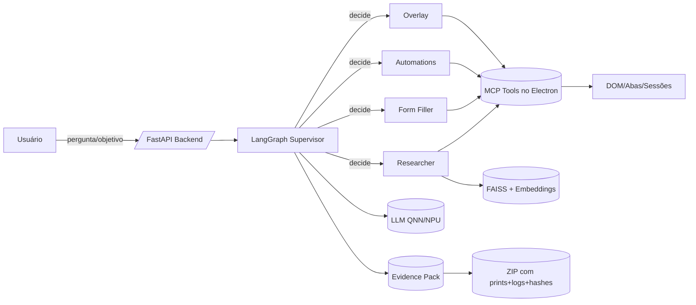

# Agentic Browser — Qualcomm + Itaú (Edge AI, NPU‑First)

> **Resumo**
>
> Um navegador **agentic** com IA **nativa no browser** para analistas do Itaú em PCs Copilot+ com **Snapdragon® X Plus/X Elite**. O sistema combina **multi‑agentes** (LangGraph, Python) com **ferramentas expostas via MCP** (no Electron/Chromium) para **perceber→raciocinar→agir** sobre páginas: pesquisar multi‑abas, preencher formulários “one‑shot”, automatizar rotinas e operar em **co‑browse assistido**. Tudo **on‑device** com **LLM Llama 3.2‑3B (QNN/NPU)** e **embeddings Nomic ONNX + FAISS**.

---

## 1) Por que este projeto

**Problema**: grande parte do trabalho de analistas acontece em **portais web** (B3, Bacen, CVM, intranet, vendors). Os fluxos são repetitivos, exigem atenção, evidências de auditoria e, muitas vezes, **não têm API**.

**Tese**: em vez de um “chat de IA”, um **browser agentic** permite que a IA atue **onde o trabalho acontece** (DOM/abas/sessões), com **evidências reprodutíveis** e **privacidade local** (dados não saem da máquina).

**Para quem**: analistas de investimentos, risco, compliance e operações no Itaú, em parceria com a Qualcomm.

---

## 2) O que ele faz (features)

### 2.1 Pesquisador multi‑abas
- Recebe uma pergunta, **abre várias fontes**, lê, deduplica, **sintetiza comparativamente** e **cita as fontes**.
- Salva **highlights** e gera **Evidence Pack** (ZIP com logs, prints, URLs, hashes, timestamps).

### 2.2 Preenchimento de formulários “one‑shot”
- Lê **PDF/brief** e preenche cadastros/inscrições/checkout com **validações de campo** (máscaras, datas, CNPJ/CPF, e‑mail).
- Gera evidências (screenshot, DOM‑diff antes/depois).

### 2.3 Automações de rotina (gravar → generalizar)
- Usuário executa 1x; o agente **generaliza** e roda em lote (ex.: baixar faturas, emitir notas, publicar conteúdo, agendar reuniões).
- Pode ser **agendado** e parametrizado (filtros, datas, destinos de arquivo).

### 2.4 Co‑browse com overlay (voz/texto)
- Enquanto o usuário navega, o agente explica a página, **sugere próximos cliques**, destaca campos e executa ações sob comando.

### 2.5 Deep Researcher (queries “encantadas”)
- Planejamento de busca, expansão semântica e **ranqueamento justificado** (coverage/recall vs. precision) para achados confiáveis.

---

## 3) Como funciona (arquitetura)

**Edge‑first**: inferência **on‑device** usando a **NPU** dos Snapdragon X (QNN EP) para **latência baixa** e **zero‑exfiltração** por padrão.

**Pilares**:
- **Backend (Python)**: **LangGraph** orquestra **multi‑agentes** e chama ferramentas via **MCP**.
- **Front (Electron + React)**: expõe **tools nativas do navegador** (openTab, find, click, fill, extract, screenshot…) como **MCP server**.
- **LLM local**: **Llama 3.2‑3B** em **ONNX/GenAI + QNN** (NPU). Embeddings **nomic‑embed‑text.onnx** + **FAISS local**.
- **Segurança**: allow/deny list por domínio/ação, detecção de prompt‑injection, **HITL** para passos críticos e **auditoria assinada**.



---

## 4) Agentes (quem faz o quê)

| Agente | Objetivo | Entradas | Saídas | Tools MCP usadas |
|---|---|---|---|---|
| **Supervisor** | Entender objetivo e rotear | `query`, `form_spec`, `automation_spec`, `overlay_mode` | Próximo nó | — |
| **Researcher** | Pesquisa multi‑fonte, deduplicação, síntese com **citações** | `query` | `findings[]`, `citations[]`, highlights | `openTab`, `extract`, `screenshot` |
| **Form Filler** | Preenchimento **one‑shot** com validações e evidências | `form_spec{url, fields[]}` | Form enviado, prints, diffs | `openTab`, `fill`, `click`, `screenshot` |
| **Automations** | Executar **rotinas gravadas/generalizadas** | `automation_spec{steps[]}` | Execução parametrizada + evidências | `openTab`, `find`, `click`, `fill`, `screenshot` |
| **Overlay** | Co‑browse assistido (voz/texto) | evento do front | Dicas, destaques, ações assistidas | `find`, `highlight`, `fill`, `click` |
| **Critic** | Segurança/compliance (prompt‑injection, políticas) | `query`, contexto | `warnings[]` | — |
| **Reporter** | Empacotar **Evidence Pack** (ZIP) | `records[]` | `evidence_zip` | — |

> **Nota**: todas as ações sensíveis passam por **HITL** (Human‑in‑the‑Loop) e são logadas com timestamp e hash.

---

## 5) Contratos MCP (tools do browser)

**Expostos pelo Electron/Chromium** via **WebSocket MCP**:
- `tool/openTab { url } -> { tabId }`
- `tool/find { selector?, text? } -> { nodes[] }`
- `tool/click { selector } -> { ok }`
- `tool/fill { selector, value } -> { ok }`
- `tool/extract { schema(JSON Schema) } -> { data }`
- `tool/screenshot { area? } -> { path }`
- *(opcional)* `tool/highlight { selector } -> { ok }`

**Princípios**: seletores **semânticos** (A11y + heurísticas + mini‑embedding), timeouts previsíveis, idempotência onde possível, e retorno **tipado** para o grafo.

---

## 6) Stack técnica

- **Backend**: Python 3.10+, **FastAPI**, **LangGraph**, **LangChain** (auxiliar).
- **LLM**: **Llama 3.2‑3B** (ONNX/GenAI) com EP **QNN** (NPU Snapdragon); fallback DML/CPU.
- **Embeddings/RAG**: `nomic-embed-text.onnx` + **FAISS** (por domínio/projeto; índices em disco).
- **Front**: **Electron + React** (outro dev do time), com **MCP server** e content‑scripts.
- **Segurança**: RBAC por papel, allow/deny list, guard de prompt‑injection, **logs assinados** e **LGPD by‑design** (redação de PII nos logs).

---

## 7) Como rodar (MVP)

### 7.1 Backend
1. `cp .env.example .env` e ajuste `MCP_WS_URL`, `ALLOW_DOMAINS`, `INDEX_DIR`.
2. `pip install -e .[qnn]`  
3. `uvicorn agentic_backend.server:app --reload --port 8080`

**Endpoints**
- `GET /health` → status
- `POST /run` → executa um job agentic

**Payloads de exemplo**
- **Pesquisa**
```json
{
  "query": "Impacto do comunicado mais recente da CVM no setor bancário"
}
```
- **Formulário one‑shot**
```json
{
  "form_spec": {
    "url": "https://intranet/cadastros",
    "fields": [
      {"selector": "#cnpj", "value": "12.345.678/0001-99"},
      {"selector": "#email", "value": "contato@empresa.com"}
    ]
  }
}
```
- **Automação**
```json
{
  "automation_spec": {
    "steps": [
      {"kind": "open", "url": "https://portal/notas"},
      {"kind": "click", "selector": "#baixar"},
      {"kind": "fill", "selector": "#mes", "value": "2025-08"}
    ]
  }
}
```

### 7.2 Front (Electron)
- Publica **MCP WebSocket** (ex.: `ws://127.0.0.1:17872`).
- Implementa as tools acima com **CDP + content‑scripts** (sem Playwright).
- Overlay para co‑browse: highlight, voice‑to‑action, confirmação HITL.

---

## 8) Segurança, privacidade e evidências

- **Zero‑exfiltração** por padrão; políticas explícitas para domínios e ações.
- **HITL** obrigatório em operações sensíveis (submissões, compras, dados pessoais).
- **Prompt‑Injection Guard** (heurístico + listas) em entradas livres.
- **Evidence Pack**: ZIP com `log.json` (ações, parâmetros redigidos), screenshots, hashes e carimbos de tempo.
- **LGPD**: redação de PII nos logs, armazenamento local controlado, retenção configurável.

---

## 9) Aderência ao regulamento do Hackathon

- **Impacto Real**: automatiza tarefas críticas dos analistas (pesquisa, KYC, compliance, backoffice), com **provas de execução**.
- **Aplicabilidade Edge AI**: processamento **on‑device** (NPU/QNN), uso de **modelos ONNX** e **RAG local**. Compatível com recomendação de uso de recursos do **Qualcomm AI Hub** (quando aplicável).
- **Escalabilidade**: agentes e tools **modulares**, policies por domínio, índices FAISS por projeto, e arquitetura **browser‑como‑API** para portais sem integração.
- **Originalidade**: IA **nativa no browser** com **MCP** e **co‑browse assistido**; “gravar→generalizar” de rotinas com pacote de evidências corporativo.

**Entrega exigida**:
- **Código aberto** (licença sugerida: **Apache‑2.0** ou **MIT**).
- **Vídeo demo ≤ 120s** (roteiro abaixo).
- **Slides (PDF)** com problema, solução, tech, roadmap.
- **Repositórios** (1–3): `backend/`, `frontend/`, (opcional) `agent-tools/`.
- **Conventional Commits** e README com setup/uso (este arquivo).

---

## 10) Roteiro do vídeo (≤ 120s)
1. **(0–15s)** Problema e público (analista Itaú, portais, repetição, compliance).
2. **(15–35s)** Demo rápida do **Pesquisador multi‑abas** (citando fontes + highlights + Evidence Pack).
3. **(35–60s)** **One‑shot form** lendo PDF e preenchendo + prints/validações.
4. **(60–90s)** **Automação** (gravar→generalizar) + **co‑browse** sugerindo cliques.
5. **(90–110s)** Arquitetura **Edge/NPU** (QNN, ONNX, FAISS, MCP, LangGraph).
6. **(110–120s)** Impacto, privacidade local, call‑to‑action.

---

## 11) Estrutura de repositórios (sugerida)

```
/agentic-browser-backend   # FastAPI + LangGraph + Evidence Pack + RAG local
/agentic-browser-frontend  # Electron + React + MCP server + overlay/co-browse
/agentic-browser-tools     # (opcional) pacotes compartilhados, schemas MCP, tipos
```

> O repositório **backend** inclui o boilerplate com grafo, policies, logs e MCP client.

---

## 12) Roadmap (MVP → Plus)
- **MVP**: pesquisador, one‑shot form, automações básicas, overlay e Evidence Pack.
- **Plus**: seletores semânticos com A11y+embeddings, aprendizado de fluxo (few‑shot), RAG por fonte, dashboards de auditoria, RBAC avançado, integração opcional com Qualcomm AI Hub.

---

## 13) Como contribuir
- **Conventional Commits** (`feat:`, `fix:`, `docs:`, `refactor:`…).
- PRs com descrição, passos de teste e *checklist* de segurança (dados/PII, domínios, HITL).

---

## 14) Licença

Sugerida **Apache‑2.0** (ou **MIT**) — garantir abertura e uso corporativo.

---

## 15) Equipe
- **Product/PO**: _nome · e‑mail_
- **AI/Backend**: Gabriel Nichols · _e‑mail_
- **Frontend (Electron/React)**: _nome · e‑mail_
- **UX/UI**: _nome · e‑mail_

---

## 16) FAQ
**Isso roda offline?** Sim. Modelos e índices ficam locais; uploads são **opt‑in**.

**E se o DOM mudar?** Seletores semânticos + `find()` híbrido (texto/A11y) reduzem fragilidade; logs evidenciam variações.

**E segurança?** Allow/deny list, guard anti‑injecção, HITL para passos críticos, e telemetria local com hashes.

**Por que não Playwright?** Porque o browser é nosso runtime; as ferramentas MCP usam **CDP + scripts** do próprio Electron.

